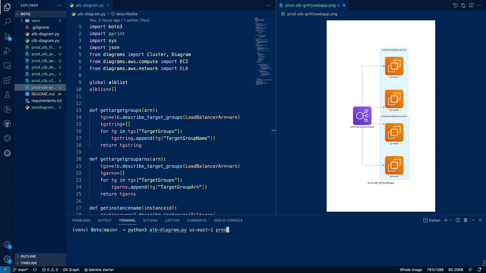

# AWS ELB Diagram Generator

This is a simple script that generates a diagram of an AWS Elastic Load Balancer (ELB) and its associated instances. The script uses the `boto3` library to query the AWS API for information about the ELB and its instances. The diagram is generated using the `diagram` library.

Here is the screenshot of the diagram generated by the script:



## Requirements

- Python 3
- `boto3` library
- `diagram` library

## Usage

1. Install the required libraries:

```bash
pip install -r requirements.txt
```

2. Set up your AWS credentials:

```bash
export AWS_ACCESS_KEY_ID=your_access_key_id
export AWS_SECRET_ACCESS_KEY=your_secret_access_key
export AWS_REGION=your_aws_region
```

3. Run the script:

```bash
# For Network Load Balancer and Application Load Balancer
python alb-diagram.py

# For Classic Load Balancer
python clb-diagram.py
```

The script will generate a diagram of the ELB and its associated instances and save on the current directory.

## License
Apache License 2.0

## For more information - Read the blog post

https://www.middlewareinventory.com/blog/creating-elb-flow-charts-using-python-boto-diagrams/


